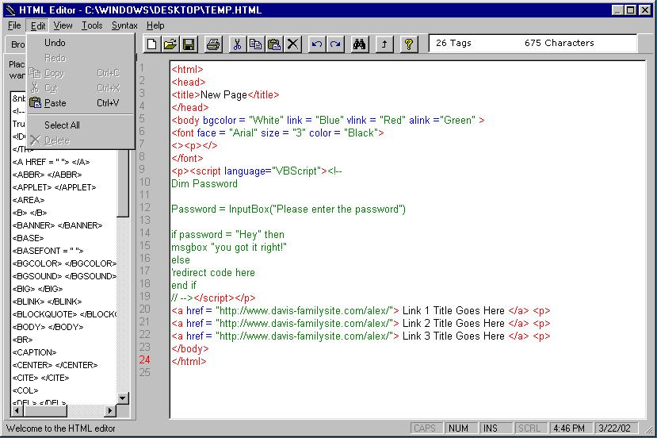



## HTML Editor 2\.0 Beta A

### Description

A small HTML Editor i've been working on for some time, let me know what you guys think. has Syntaxing, a file browser and generates a bunch of the html for you as well, comes with a simple viewer to view your page. Please give me feedback on how to fix bugs. thanks guys adn enjoy
 
### More Info
 

             |
---                |---
**Submitted On**   |2002-03-22 16:40:58
**By**             |[Alexander D](https://github.com/Planet-Source-Code/PSCIndex/blob/master/ByAuthor/alexander-d.md)
**Level**          |Intermediate
**User Rating**    |3.8 (19 globes from 5 users)
**Compatibility**  |VB 5\.0, VB 6\.0
**Category**       |[Complete Applications](https://github.com/Planet-Source-Code/PSCIndex/blob/master/ByCategory/complete-applications__1-27.md)
**World**          |[Visual Basic](https://github.com/Planet-Source-Code/PSCIndex/blob/master/ByWorld/visual-basic.md)
**Archive File**   |[HTML\_Edito645723222002\.zip](https://github.com/Planet-Source-Code/alexander-d-html-editor-2-0-beta-a__1-32929/archive/master.zip)

